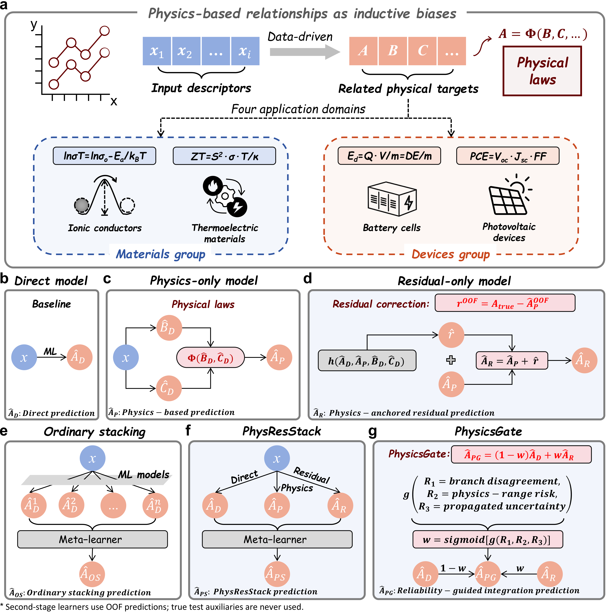

# PhysicsGate

PhysicsGate combines direct predictions with physics-anchored residual
predictions using a sample-specific reliability weight.

## Method

For a target property, PhysicsGate combines a direct prediction and a
physics-anchored residual prediction:

$$
\hat A_{PG}
= (1-w)\hat A_D+w\hat A_R
= \hat A_D+w(\hat A_R-\hat A_D),
\quad 0 \leq w \leq 1.
$$

The residual branch first corrects the equation-derived prediction:

$$
\hat A_R=\hat A_P+\hat r.
$$

The physics-only prediction is calculated from independently predicted
auxiliary properties, and the residual correction is learned from
training-side out-of-fold (OOF) physics residuals. The sample-specific weight
is

$$
w=\frac{1}{1+e^{-g(R_1,R_2,R_3)}}.
$$

This is a sigmoid transformation, where *g* is a standardized ridge model and:

- R<sub>1</sub>: disagreement between the direct and residual branches;
- R<sub>2</sub>: risk that the physics prediction lies outside the training range;
- R<sub>3</sub>: target-normalized first-order propagation of training-side OOF
  auxiliary RMSE estimates through the physical equation. Local sensitivities
  use central finite differences with
  `delta = max(1e-6, 1e-4 * abs(auxiliary prediction))`; LMB routes use analytic
  derivatives. It is an empirical error proxy, not a calibrated predictive
  uncertainty.



## Installation

```bash
python -m pip install -r requirements.txt
python -m pip install -e .
```

## Quick Start

```python
from physicsgate import PhysicsGate, reliability_features

features = reliability_features(
    direct=direct_oof,
    physics=physics_oof,
    residual=residual_oof,
    training_targets=y_train,
    propagated_auxiliary_error=propagated_error_oof,
)

gate = PhysicsGate(alpha=1.0).fit(
    y_oof=y_train,
    direct_oof=direct_oof,
    residual_oof=residual_oof,
    reliability_oof=features,
)

prediction = gate.predict(
    direct=direct_test,
    residual=residual_test,
    reliability=test_features,
)
```

All gate-training predictions must be generated out of fold from training
data.

## Paper Figures and Tables

Figures 1-3 are retained with their plotted CSV data. Rebuild Figures 4-5 and
S1-S3 with:

```bash
python reproduce.py
```

The manuscript tables are in [`results/tables`](results/tables):

- `Table1.csv`: benchmark map used in the main text;
- `TableS1.csv`-`TableS8.csv`: provenance, equations, architectures, complete
  metrics, paired gains, mechanism diagnostics, literature context and
  stabilization sensitivity.

Run the core tests with:

```bash
python -m pytest
```

## Train from Source Data

Raw datasets are not redistributed. DOI links and filenames are listed in
[`data/sources.csv`](data/sources.csv). Preprocessing commands are in
[`data/README.md`](data/README.md). Run the four matched training entrypoints
with:

```bash
python scripts/train_sse.py  --all-evaluated-splits
python scripts/train_estm.py --all-evaluated-splits
python scripts/train_lmb.py  --all-evaluated-splits
python scripts/train_pv.py   --all-evaluated-splits
```

The evaluated domains and equations are:

| Dataset | Domain | Physical relationship |
|---|---|---|
| SSE | Solid-state electrolytes | Arrhenius conductivity relation |
| ESTM | Thermoelectric materials | ZT = S<sup>2</sup>&sigma;T/&kappa; |
| LMB | Liquid metal batteries | E<sub>d</sub> = QV/m = DE/m |
| PV | Photovoltaic devices | PCE = V<sub>OC</sub>J<sub>SC</sub>FF |

All targets compare Direct, Physics-only, Residual-only, Ordinary stacking,
PhysResStack and PhysicsGate. Exact split identifiers are in
[`configs/evaluated_splits.json`](configs/evaluated_splits.json); the reporting
scope is in
[`source_data/provenance/Evaluation_Scope.csv`](source_data/provenance/Evaluation_Scope.csv).

## Leakage Controls

- True validation or test auxiliary targets are never used in equations.
- Residual correction, stacking and gate fitting use training-side OOF
  predictions.
- Group-aware inner folds are used when the outer split is group-aware.
- Hyperparameters are selected using training data only.
- Held-out labels are reserved for final evaluation.

## License

This project is released under the MIT License.
